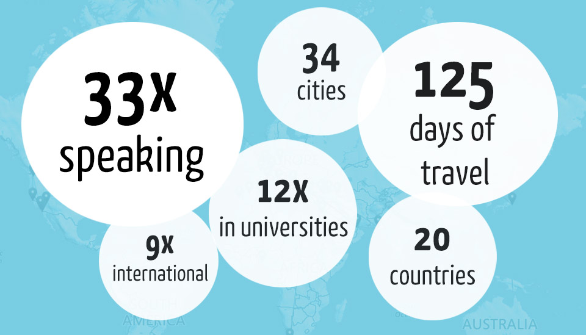

It's been one hell of a busy year. Don't get me wrong 2018 will be worse, and that's a good thing. I like *busy* as long as it aligns with productivity. I have already multiple projects ready for kick off at the beginning of 2018 :) Unfortunately, some of these will be local to Turkey, where I live. While we are at it (Turkish vs English), let's talk about how this blog is going on.

My original intentions were to create some fresh content on this blog. I wanted to rechannel some of my time to develop English content instead of Turkish. Now that I look at it, the blog ended up being a place where I merely report where I spoke, and share decks, recordings of some of my sessions. I have plans to fix this. I can maybe move events into a separated section of the blog. But the original problem is still out there; I couldn't find the time to write unique content. This wasn't just about English by the way; even on my Turkish blog, I got only two technical articles published. So, what did I do then?

I always like to look back when the year ends and try to extract some statistics to show off :) and hopefully be proud. Apparently, for me, the highlight of this year was the amount of travel I did both for business and community.  Is that **125 days** out of the country? OMG. It looks like I managed to squeeze in a good amount of offline speaking with a better emphasize on international conferences. Considering the fact that my decision of separating my time between English and Turkish instead of entirely Turkish, was made in July, this looks pretty good for just six months right? 

## So what's next? 

I will give no spoilers my friend :) Let's stay in touch on [twitter](http://www.twitter.com/daronyondem), and maybe you can drop [your e-mail here](http://eepurl.com/cU3_0T) for some future updates.  I will make sure we will meet again next year ;)
