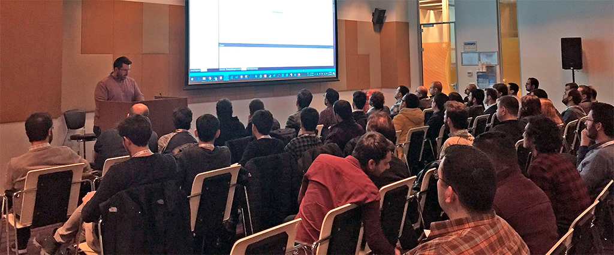

Yesterday was the day of **SQL Saturday** for Istanbul. Thanks to an invitation from my RD peer [Koray Kocabaş](https://twitter.com/koraykocabas?lang=en) I had the chance to talk about CosmosDB. 

CosmosDB is one of the services in Azure which I'm in love with. While at it, let me give you the full list, Azure Functions, Container Instances and CosmosDB :) As you might have noticed I'm all for high level, managed services. CosmosDB is a serious game changer and will continue changing our expectations of a cloud database engine. I have heard some rumors that the upcoming [Microsoft Connect](https://www.microsoft.com/en-us/connectevent/default.aspx) event will have some fantastic news about CosmosDB. Go ahead, save the date, it is November 15-17. 

Unfortunately, this time I don't have a recording of my session. I do have the slides to share tough. 

As always, for anything, ping me on Twitter!

See you next time. 