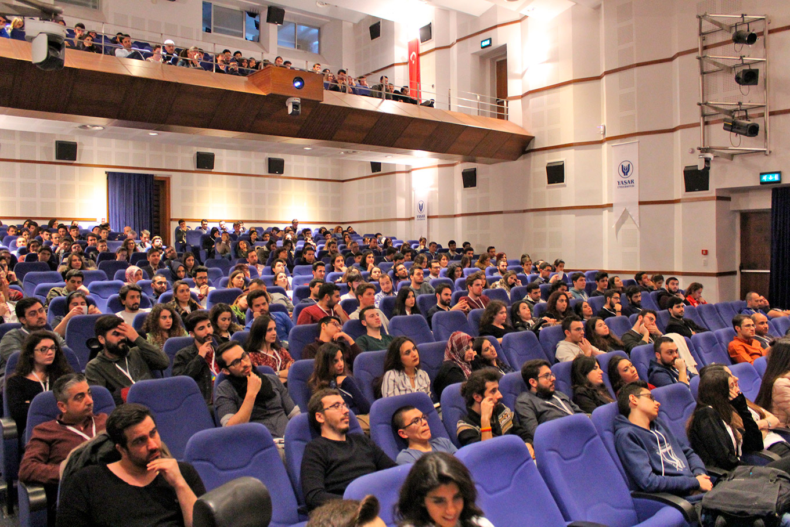
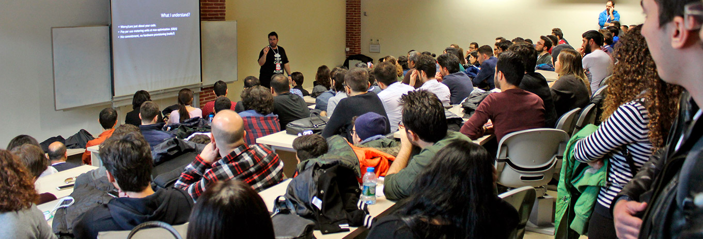

Yesterday I was in Izmir, Turkey for the annual **Google Developer Groups DevFest** conference. Initially, I got invited to present my motivational speech titled *"Better work for nothing, than staying idle"* (Excuse my poor translation of a Turkish Proverb "Boş Durma, Boşa Çalış"). I didn't want to fly to Izmir just for a motivational speech. That is fine where attendees come from a mixed background. In the case of GDG, the audience is mostly developers. So I offered the event team to add a technical session into the mix. They made it happen. 

Besides my motivational talk, I had the chance to talk about **Serverless** and **Azure Functions**. To be honest, I was surprised seeing the room packed, people on the stairs. Thanks everyone for joining. It was a lovely day.

I should thank the GDG Izmir Event Team for their hard work making such a big conference a success. Finally, I should thank everyone from IEEE Yasar University for being with me the whole day :) Your excitement for community events is legendary. Spoiler alert: I will be visiting Izmir soon for another event. Stay tuned on [twitter](https://twitter.com/daronyondem) and [facebook](https://www.facebook.com/daronyoendem) ;) 
