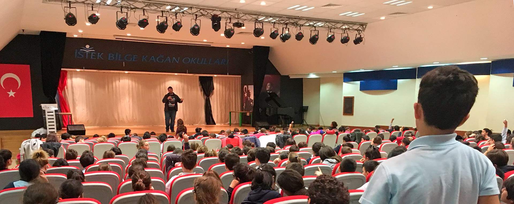

It was the "[HourOfCode](https://hourofcode.com/)" time of the year again. Every year between 4-10 December it is [The Computer Science Education Week](https://csedweek.org/), and that's when HourOfCode happens. This year I received an invitation from **Istek Bilge Kagan K12 Schools** in Istanbul.  It was their lovely IT Teacher [Ayşenur Öznalçın](https://twitter.com/aysenurrlive) who invited me to meet with the students who were already doing some fantastic stuff. 

We started the day with a short speech from me talking about how I began development when I was in middle school. They were surprised to hear that I didn't have a computer back then. I was writing code on paper at home and transferring it to a computer at school to test it out. Today these kids have Bluetooth connected lego pieces, OMG! Seriously, I learned a lot during the day about how far we have come getting our kids to code and how much more we need to work and invest in feeding their curiosity and hunger to progress and push them forward. 

Again, huge thanks to Ayşenur Öznalçın and the school management for having me in their HourOfCode event. It was a blast. 
