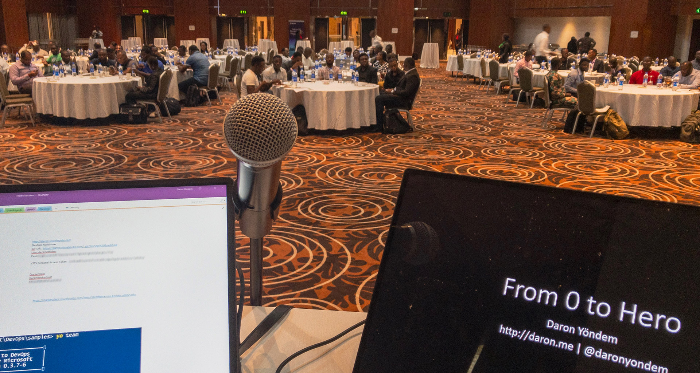

Yesterday I was in Lagos, Nigeria for the **Microsoft Master Development Series** DevOps event. We talked about **CI/CD with VSTS, Containers, Docker, Azure Container Instances and Azure Container Registry**. This has been the fifth stop of my DevOps tour in MEA and a special one considering the time we had to allocate for Q&A :) I don't remember receiving so many questions in an event, ever! It was lovely! Thanks everyone for the huge interest you showed in all session during the day. 

The decks I use during the DevOps Roadshow are still the same. Here is the link for those who missed it in my previous blog posts [http://daron.me/decks](http://daron.me/decks).

See you in another one ;)