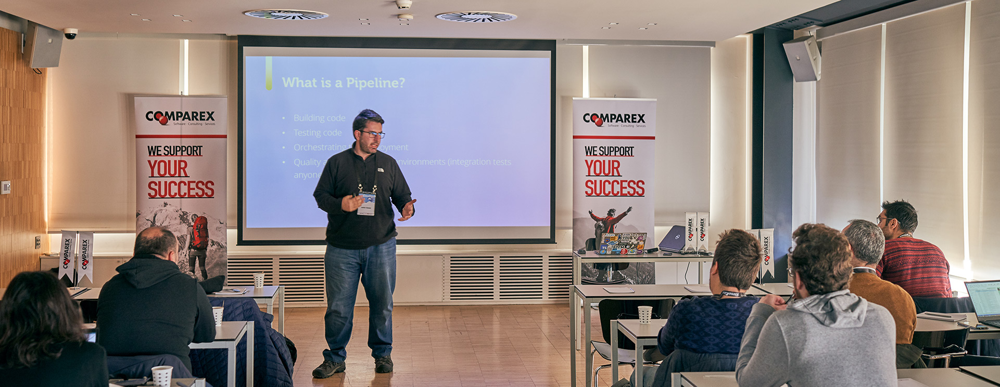

Yesterday was crazy! I had two events to speak in two separated cities :) Both events deserve separate blog posts, so there we go with the first one.

The first event for the day was "[Azure DevOps Day Istanbul](https://www.azuredevopsday.istanbul/)". 12 speakers (8 MPVs) in a single day / track meant every speaker had only 20 minutes to present their topic. Short presentations are always a challenge. As short as the presentation time gets as long as it takes to get prepared for it :) Luckily I picked a pretty niche / narrow topic to make it easy for me; PaC (Pipeline-As-Code).  [Here you can find the presentation](https://speakerdeck.com/daronyondem/implementing-pipeline-as-code) I used. 

Thanks to our local user group [MSHowTo](http://www.mshowto.org/) for organizing the event. They have been very flexible in letting me have the first session for the day so that I can fly to Antalya for my second event for the day. Very appreciated. 

You think that was it for my Saturday here? Wait for my next blog post. 

Cheers!

