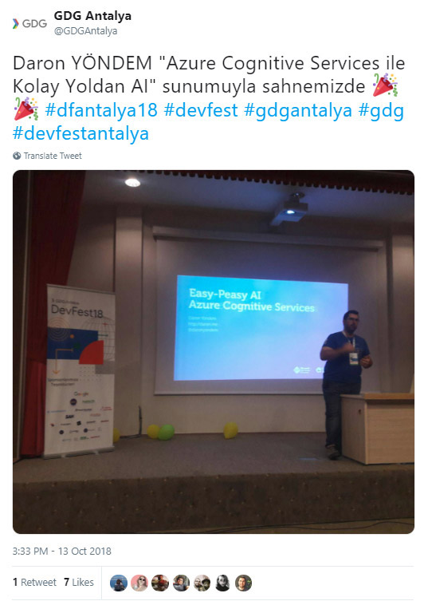

What a weekend! Yesterday I took a one-hour long flight to Antalya, Turkey for the annual Google Developer Community DevFest conference. It was soo much fun :) The event organizers were so enthusiastic and full of energy, they made my whole day an amazing one. I will be honest; sometimes when I speak at a conference, my visit happens to be just about my session. I don't know why, or how, but somehow I don't feel at home outside the time slot I'm given to speak. You might imagine that a Google conference can be precisely that for someone like me who usually talks about Microsoft stack. Contrary I had so much fun with all the lovely speakers, students organizing the event and everyone else! Thanks to [the GDG Antalya team](https://twitter.com/GDGAntalya) for having me! Hope to see you next year again :)

My session for the day was about **Azure Cognitive Services**, and I had some nice Azure Functions demos squeezed in it. [Here are the slides](http://daron.me/decks) in case you want to give it a look. I like services/technologies that can enable developers to do more in a very short time. Both Cognitive Services and Azure Functions are exactly that! Now, go and try these out yourselves if you still didn't look into any of the turn-key AI APIs in Azure Cognitive Services. 

See you next time ;)

