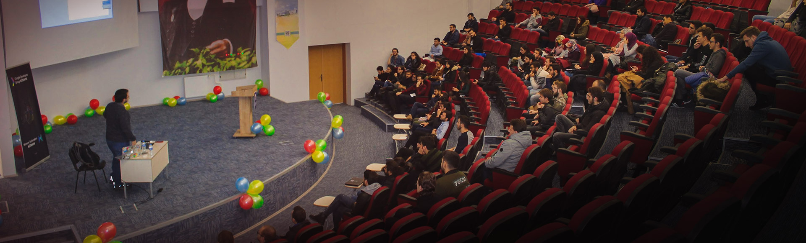

Woohoo :) This is my 3rd GDG this quarter. Really enjoying the hospitality of Google all over these student communities. For more than 10 years I have been invited to many Microsoft sponsored/supported student events, but would never think of speaking in so many Google supported events and still be able to share what I know without worrying about if it aligns with Google's trends/targets or whatever corporate verbiage you prefer :) Google is really doing a fantastic job here. Helping students get their community running, and not try to limit their freedom on how they organize their events, the agenda. 

Yesterday, I took a day trip to Kutahya, Turkey. It is a 3-4 hour drive from Istanbul. I had two sessions during the day. One was about Azure Cognitive Services and how it can be used building AI-powered mobile experiences. The second session was my "self-motivation" session that I'm being asked a lot recently :) For those students between you who are planning to invite me to an event for a self-motivation talk (it happened a couple of times so far) that can't be the only reason for me to travel. My personal-requirement is to do at least one tech talk when I go outside the city.  So, there you know :)

I want to thank everyone involved in the event. I enjoyed it very much! The eight-hour drive didn't even touch my skin :) Everyone else, thanks for being with us!

As always, [here is the presentation deck I used](https://speakerdeck.com/daronyondem/easy-peasy-ai-azure-cognitive-services).

See you next time ;)