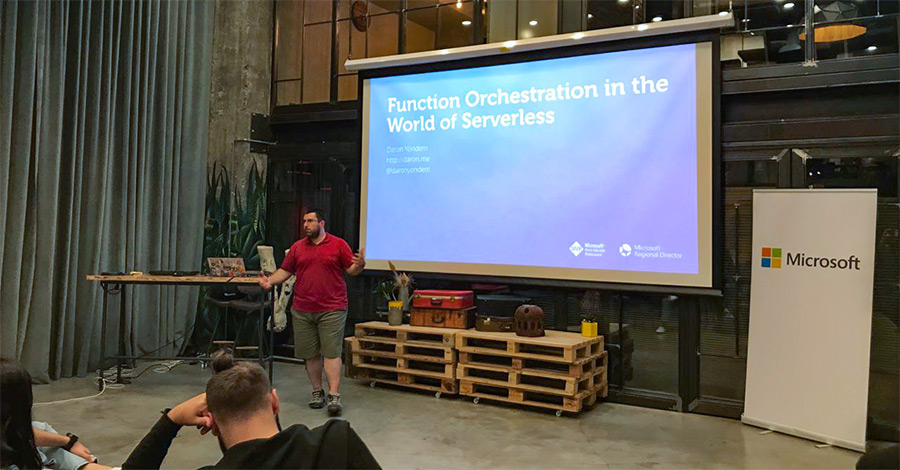

Yesterday I had the chance to speak in our local [Xamarin Meetup Group](https://www.meetup.com/Xamarin-Istanbul-Development-Meetup/). The meetup group is primarily managed by one of my favorite MVPs; [Yiğit Özaksüt](https://twitter.com/ozaksuty). Recently he started writing in English as well :) Take a look at [his blog](http://ozaksut.com/) if you are interested in Xamarin :) My topic for this meetup was function orchestration. I covered two different worlds, function orchestration with Azure Durable Functions, and using Logic Apps for function orchestration with a simple UI. 

Thanks for everyone being there with us till 11.00 PM :) [Here is the slide deck](https://speakerdeck.com/daronyondem/function-orchestration-in-the-world-of-serverless) in case you wanted to tap into the list of additional resources I have shared there. 

See you next time.

