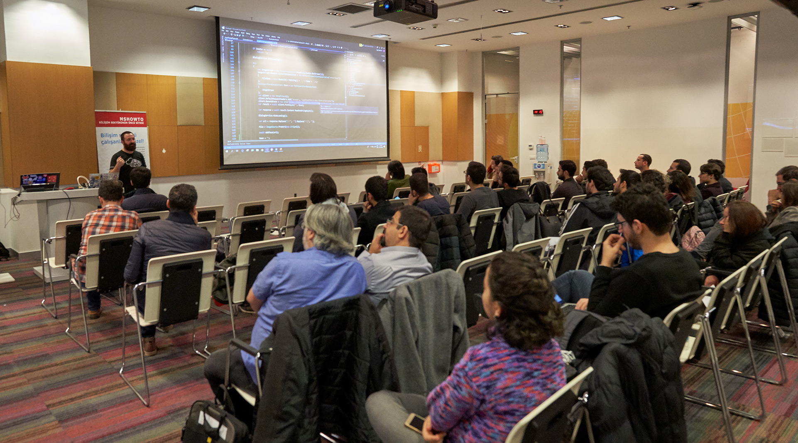

Yesterday was the day of [Global AI Bootcamp](https://www.globalaibootcamp.com/) for [Istanbul](https://www.globalaibootcamp.istanbul/).  You might have noticed that I'm a big fan of Azure Cognitive Services, mostly talking about it at every opportunity, user group meeting, or conference :) I think it is the type of high-level service set that is going to enable most of us delivering value through the implementation of AI into common software. Even though (rightfully) there is a trend in the community, and developers investing in data science, ML, AI skill set (am I missing any trends here?) not all of us will be able to jump into it, or willing to. Cognitive Services makes AI accessible to every developer out there. That's why I love it! I like simple things.  

*That's not me up there! It's Yigit. Unfortunately, no one took my photo during my presentation. This is getting worse right? :)*

When I got invited to speak at the local AI Bootcamp I wanted to do something different, something that's not just introducing an Azure service, but more of a sample implementation of it. We got together with our resident Dev MVP, Xamarin Guy :) Yiğit Özaksüt. After a couple of instant messages, we decided to go with a face login sample. The plan was to use Azure Cognitive Service Face API to implement a POC face login that would work on every platform thanks to Xamarin. 

I decided to build a couple of Azure Functions to expose the functionality the client application needs. The app will take a photo, upload and do a lookup to figure out who that photo belongs to. We need to be able to train the AI, upload photos of a person and run it through Cognitive Services. I ended up building three simple functions. Thanks to the concept of consumption plan everything in the back-end including the APIs and Cognitive Services all is pay-for-what-you-use :) I guess every vendor calls that "Serverless" nowadays. I remember we called it "Cloud" at some point :) Sarcastic jokes aside, the poc code is [up here on github](https://github.com/Teknolot/ai-bootcamp-2018-demo). I got word from Yigit that he is going to upload the client code as well :) Stay tuned!

I have plans publishing a more detailed write-up about the back-end implementation, but who knows when it is going to happen. If you are curious, take a look at the source code now :) Thanks everyone for being there with us. See you at the next one. 

