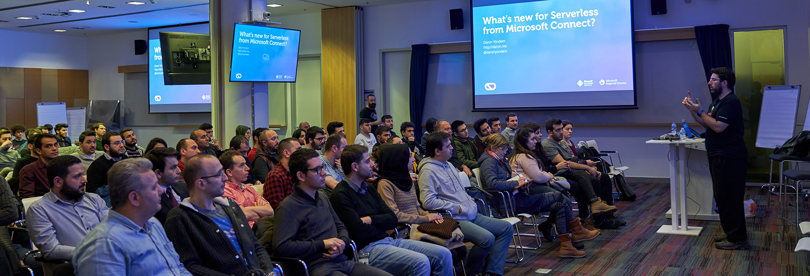
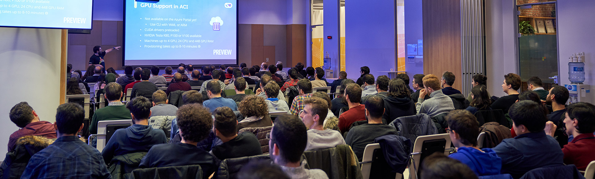

You might have heard about [Microsoft Connect](https://www.microsoft.com/en-us/connectevent/). It is an online conference globally organized by Microsoft. It does not have its localized versions like the [Build Tour](https://blogs.windows.com/buildingapps/2017/05/17/announcing-microsoft-build-tour-2017/#BlTvlo4lLDgRJsmv.97), or [Ignite](https://www.microsoft.com/en-us/ignite-the-tour/). However, that didn't stop us here, in Istanbul :) Me and my friend [Yigit](https://twitter.com/ozaksuty), two MVPs :), we got in touch with our local Microsoft subsidiary. We told them we wanted to do a local version of Connect arguing that the language barrier makes it very hard for the content presented at the global Connect conference reach our Turkish community. They said "ok" and got us a venue :) Now that I'm looking into the conference evaluation forms only 15% of our attendees knew about the global event. 

We had a very short time to plan everything, so we landed with the date of 29th December, yesterday it is. If that's what you are thinking, you are not the first one to imagine that's a terrible date for a conference :) However, having organized events for more than 11 years now, I know people attend conferences with good content whatever the date it is on. We had 120 seats in our venue, 140 people showed up yesterday!

First of all, huge thanks to [Bilgin Biltekin](https://twitter.com/bilginbiltekin) and [Cihan Yakar](https://twitter.com/cihanyakar) for making this conference a success. They covered a total of three sessions ranging from ML to .NET Core. Bilgin and Cihan are speakers of our local user group called [Teknolot](https://teknolot.com). As this event was not an official Microsoft event, we took it under the umbrella of our user group to get things running. Thanks to Microsoft for helping us with the venue and the food :) Thanks to [sessionize](https://sessionize.com/) for the CFP platform. Finally, thanks to [Dikeyeksen](https://www.dikeyeksen.com/), one of our leading local tech book publishers for their generous gifts during the day.  

A big thanks to everyone who attended the conference on a December 29th :) See you next time! Maybe on a 30th December? :)

P.S. The deck I used during my session is [here](https://speakerdeck.com/daronyondem/whats-new-for-serverless-from-microsoft-connect) and the sample code I used is on [github](https://github.com/Teknolot/ms-connect-2018-demo) :)

