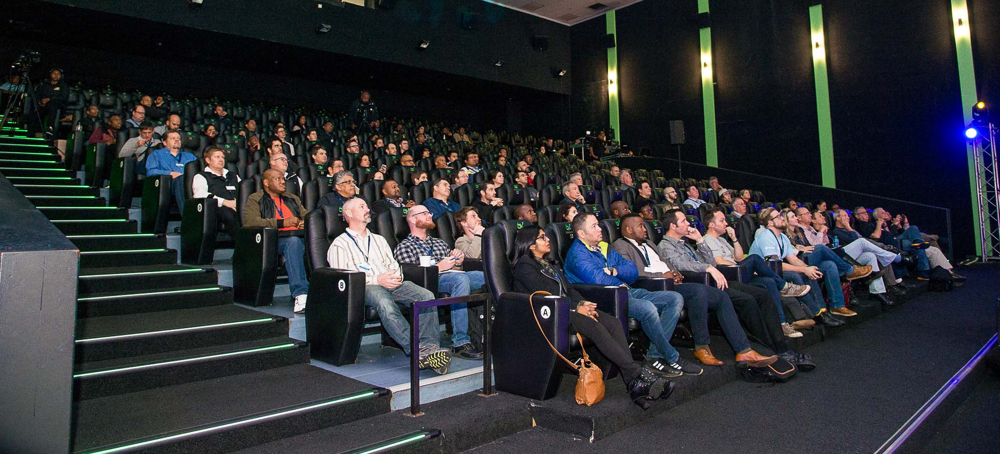

28 hours of flight for 28 hours of stay and 1 hour of talk. Remember this if you ever get jealous of a speaker traveling around the world :) It is not always that pretty. Tough, it was pretty fun to talk about Blockchain and AI in Cape Town for Microsoft Future Summit. 

During my session, I had the chance to talk about distributed ledger technologies, how blockchain works and how enterprises can roll their private, or consortium DLTs with Azure Blockchain Workbench. First of all, huge thanks to the South African Microsoft team for the beautiful organization, and of course thanks for having me :) The team really knows what they are doing. They did not take the stage themselves, they invited customers to speak and share their experiences and invited MVPs to do all tech demos. [Warren du Toit](https://twitter.com/warrendt), another Azure MVP, from South Africa took the stage for most other sessions, and I should say I'm fascinated with the fluidity of his demos. Job done very well in every aspect. I need to send a final "thanks!" to the Azure Blockchain Engineering Team for their help getting my demos straight :) 

[Here you can find my presentation](https://speakerdeck.com/daronyondem/blockchain-and-ai), the team took a recording of my session as well. I will share that when ready.

See you next time ;)