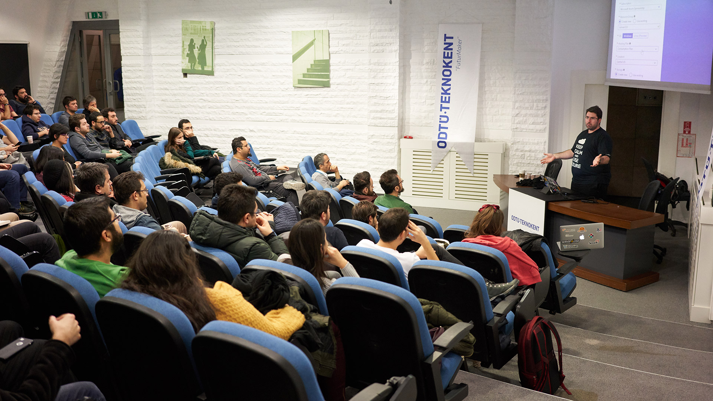

Yesterday, I made a day trip to Ankara. To be honest, It was just a half day trip. Took a flight to Ankara around 2 PM and got back around 1 AM in the night. It was worth every minute though!

As some of you might have already noticed :) I love talking about Serverless and Azure Functions. When the [Serverless Turkey Meetup](https://www.meetup.com/en-AU/Serverless-Turkey/) organizers invited me to Ankara to speak about Azure Functions, I was already purchasing my tickets. Seriously, at first, I was a little bit hesitant investing my own money in buying roundtrip flight tickets for such a short event. I usually expect event organizer to pay for it, hoping they can compensate through their sponsors. However, the feeling of *"People need to know about Azure Functions"* took over :) and I'm thankful it did. I loved the discussions we had. I learned so much about AWS Lambda, and how it compares to Azure Functions :) There were a lot of AWS Lambda users in the event. Might be just because the meetup organizers are Lambda users as well, who knows?

I guess the highlight of the day was **Durable Functions**. That's a killer feature for Serverless development, and currently, none of the competing frameworks/services have an alternative. You should look into it if you are interested in FaaS. 

During the event, I used my Serverless decks from my full day Serverless training. Feel free to [grab the slides here](http://daron.me/decks) ;) If you are wondering if we have plans to do a meetup in Istanbul as well. We do! [Here is the link for registration.](https://www.meetup.com/en-AU/Serverless-Turkey/events/247731411/)

See you on the next one.